# NXP Application Code Hub
[](https://www.nxp.com)

## Facial Detection Zephyr Demo
Multiple Face detection based on a machine learning algorithm.  A portable Zephyr application that runs on MCXN947 with ML accelerated by the NPU, and on i.MX RT1060.  This demo analyzes images from a camera, displays the image on the display, and reports when it detects a face.

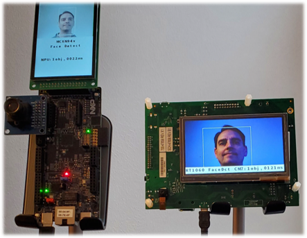

#### Boards: FRDM-MCXN947, MIMXRT1060-EVKB
#### Categories: AI/ML, RTOS, Vision
#### Peripherals: DISPLAY, DMA, FlexIO, I2C, VIDEO
#### Toolchains: GCC, VS Code

## Table of Contents
1. [Software](#step1)
2. [Hardware](#step2)
3. [Setup](#step3)
4. [Results](#step4)
5. [Support](#step5)
6. [Release Notes](#step6)

## 1. Software<a name="step1"></a>
zephyrApps is a West manifest repository.  It uses West to pull in the Zephyr repo and modules, including hal_nxp, see [West T2 star topology](https://docs.zephyrproject.org/latest/guides/west/workspaces.html#t2-star-topology-application-is-the-manifest-repository).

Install all the needed tools and dependencies for using Zephyr.  NXP recommends using the MCUXpresso Installer to install all the tools and dependencies.  This tool is installed if using the VS Code MCUXpresso extension, see the [wiki](https://github.com/nxp-mcuxpresso/vscode-for-mcux/wiki/Dependency-Installation).

## 2. Hardware<a name="step2"></a>
The demo runs on two platforms:

### MCX platform
* [FRDM-MCXN947](https://www.nxp.com/design/design-center/development-boards-and-designs/general-purpose-mcus/frdm-development-board-for-mcx-n94-n54-mcus:FRDM-MCXN947)
* NXP [LCD-PAR-S035](https://www.nxp.com/design/design-center/development-boards/general-purpose-mcus/3-5-480x320-ips-tft-lcd-module:LCD-PAR-S035) display
* [OV7670 Camera](https://a.co/d/2gMekqz)
* recommended [wide-angle lens](https://www.amazon.com/dp/B07M61QSV2?_encoding=UTF8&psc=1&ref_=cm_sw_r_cp_ud_dp_D9Q5ZANAX2Y8MWTCV4NB)
* USB Type-C cable

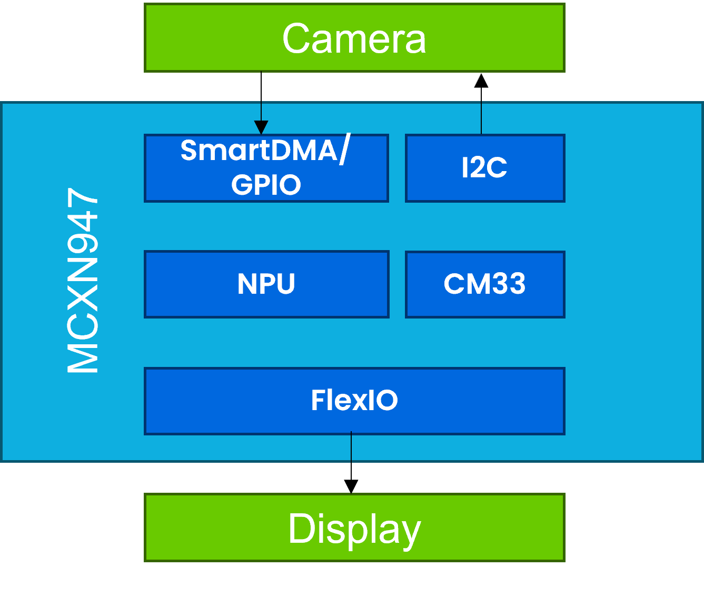

## RT platform
* [MIMXRT1060-EVKB](https://www.nxp.com/design/development-boards/i-mx-evaluation-and-development-boards/i-mx-rt1060-evaluation-kit:MIMXRT1060-EVKB)
* [RK043FN66HS-CTG](https://www.nxp.com/design/development-boards/i-mx-evaluation-and-development-boards/4-3-lcd-panel:RK043FN66HS-CTG) display
* MT9M114 Camera (comes in RT EVK kit)
* micro USB cable

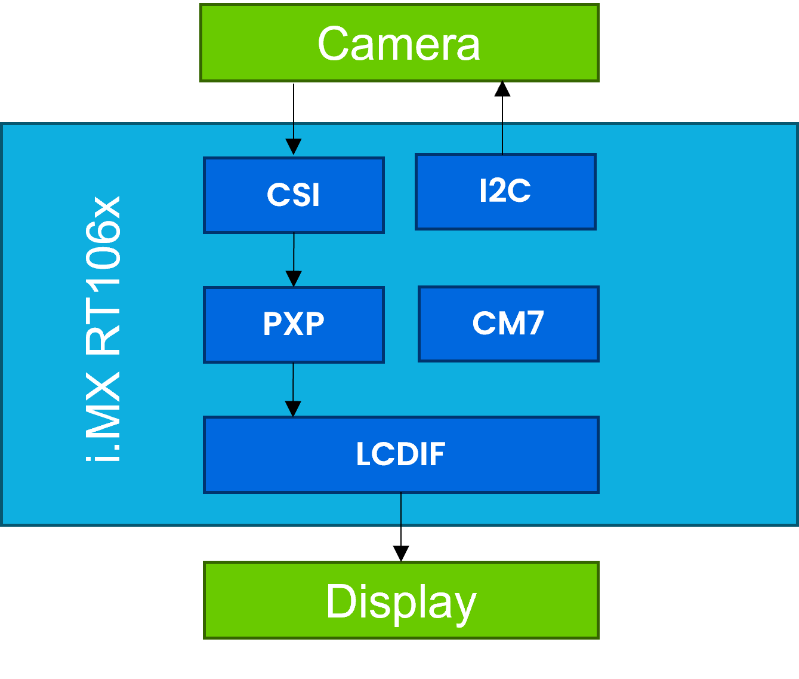

## 3. Setup<a name="step3"></a>
### 3.1 Step 1
If using the FRDM-MCXN947 board, it must be modified and assembled for this demo.

Rework the camera pins on FRDM-MCXN947 because the camera is not the default function. Please change SJ16, SJ26, and SJ27 from the A side to the B side.

Board before rework:

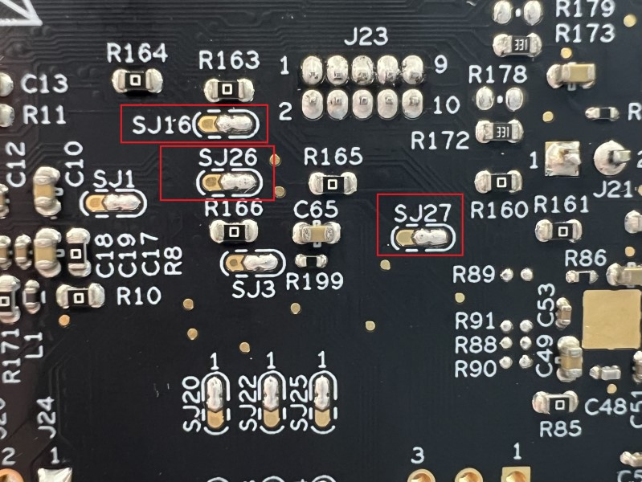

Board after rework:

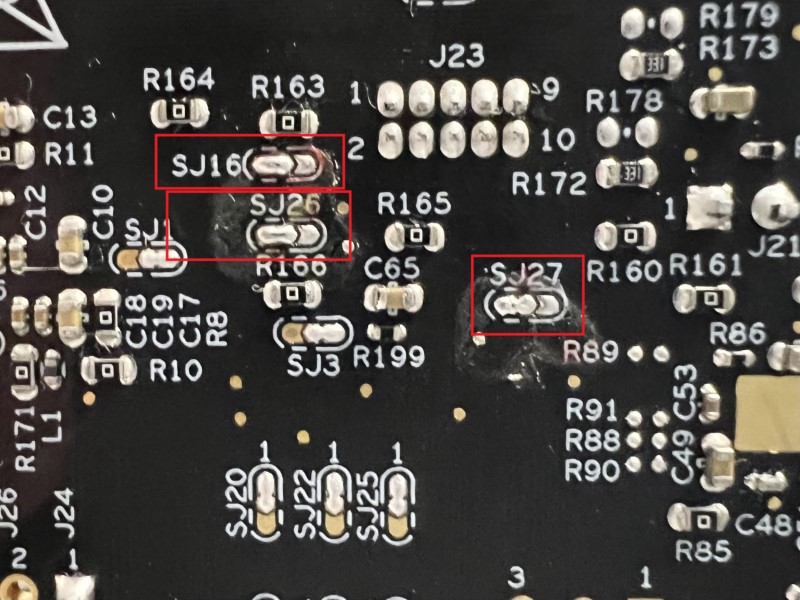

More details on these changes:

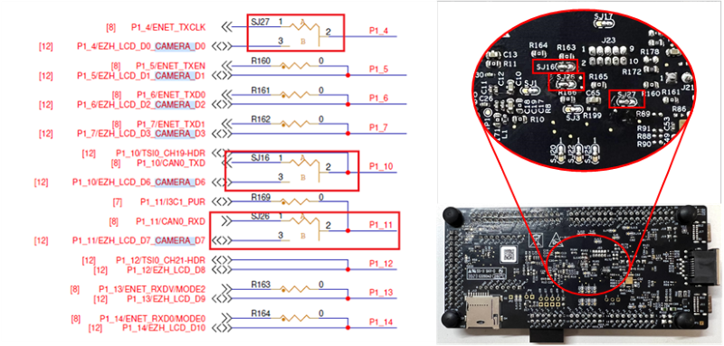

Attach the LCD-PAR-S035 shield (J1: Pins 5-28 skip first 4 pins) to the FRDM-MCXN947 (J8). Attach the Camera shield to the FRDM-MCXN947 (J9: Pins 5-23; skip first 4 pins), as shown below:

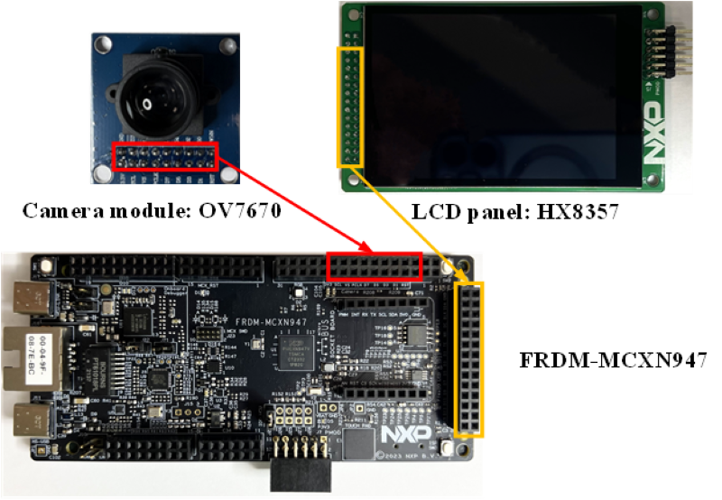

Connect a USB Type-C cable to the USB debug port J17 on board:

### 3.2 Step 2
If using the MIMXRT1060-EVKB board, assemble the RK043FN66HS-CTG display to the bottom side of the board.  Connect the camera MT9M114 to the connector J46 on the top side of the board in the bottom right corner.  But the flex cable of the camera will need to wrap around to the bottom side of the board, so the camera and display face the same direction.  Connect a micro USB cable to J1 to debug/program/power the board.  (Note: the image below shows powering through USB J48.  This option is not connected to the on-board debugger, but is best for demos.  To use this option, the jumper on the 2x5 header J40 must be changed from 5-6 to 3-4.)

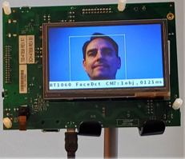

### 3.3 Step 3
Cloning the demo repo:
The typical Zephyr development flow is used by this demo.  This uses the West tool, and requires these tools and Zephyr dependencies to be installed on the host computer.  The two options supported are:
- Using Visual Studio Code (VS Code) with NXP's MCUXpresso extension
- Using West with the Command Line Interface (CLI)

### Cloning and building with VS Code
- Follow the steps at [MCUXpresso for Visual Studio Code](https://github.com/nxp-mcuxpresso/vscode-for-mcux/wiki).  This includes using NXP's MCUXpresso Installer to install all the needed tools and dependencies for using Zephyr with VS Code.  Review these steps for how to import a Zephyr repo, and how to import a Zephyr sample application from that repo.
- In VS Code, using the MCUXpresso extension, open the **Import Repository** wizard.  This example creates a folder called `zephyrApps` for the workspace.  Import the repo `https://github.com/nxp-zephyr/apps_zephyr`, and set the Revision to `FacialDetect`.

  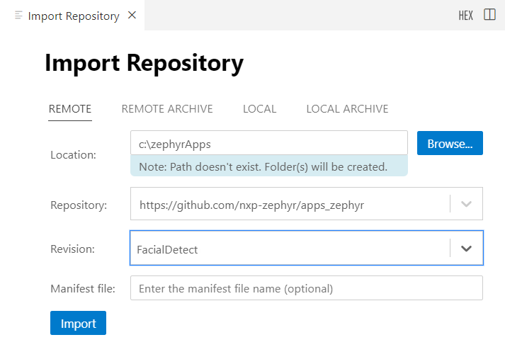

Then you can **Import Example from Repository**.  The example below imports the `FacialDetect` app for the `mimxrt1060_evkb` board:

  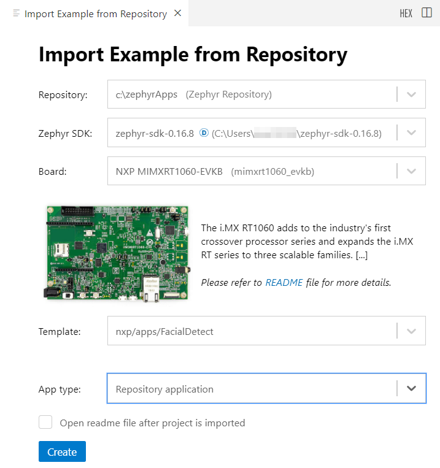

For the FRDM-MCXN947 board, **Import Example from Repository** for the `frdm_mcxn947/mcxn947/cpu0` board:

  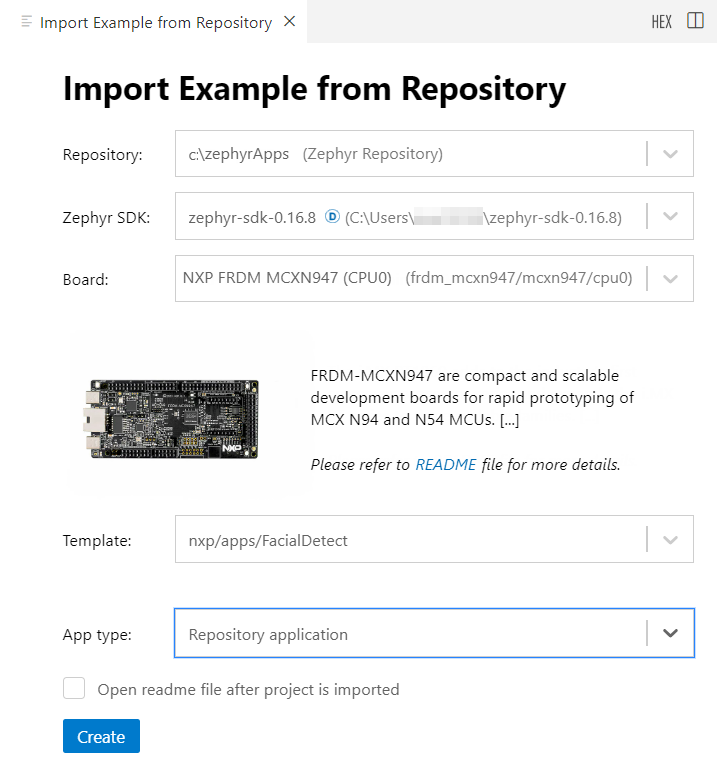

Then follow the steps detailed at [MCUXpresso for Visual Studio Code](https://github.com/nxp-mcuxpresso/vscode-for-mcux/wiki) to build and debug the sample application.  Detailed [Zephyr lab guides](https://github.com/nxp-mcuxpresso/vscode-for-mcux/wiki/Training-Zephyr-Getting-Started) are also provided at that wiki.

### Cloning and building with CLI
Start in the directory you want the zephyrApps folder located:
```
west init zephyrApps -m https://github.com/nxp-zephyr/apps_zephyr --mr FacialDetect
cd zephyrApps
west update
cd nxp
west build -b mimxrt1060_evkb apps\FacialDetect --pristine
    or
west build -b frdm_mcxn947//cpu0 apps\FacialDetect --pristine
```

## 4. Results<a name="step4"></a>
The application will immediately show the camera video on the display.  When faces are detected, white rectangles are drawn around each face.  The inference time is printed on the display.


### FacialDetect folder structure:
```
zephyrApps/
│
├── modules/                    # other modules pulled in by West
│   ├── hal/
│   |   ├── cmsis/
│   |   └── nxp/                # NXP's HAL with MCUXpresso SDK drivers
│   └── lib/
│       └── tflite-micro/       # TensorFlow Lite
├── nxp/                        # West manifest repo
│   ├── apps/
│   │   └── FacialDetect/       # demo application
└── zephyr/                     # Zephyr repo pulled in by West
```

## 5. Support<a name="step5"></a>
* For support specific to this demo, go to https://github.com/nxp-zephyr/apps_zephyr/issues
* For VS Code support, go to https://community.nxp.com/t5/MCUXpresso-for-VSCode/bd-p/mcuxpresso-vscode
* For NXP Zephyr support, go to https://community.nxp.com/t5/Zephyr-Project/bd-p/Zephyr-Project
* For general Zephyr questions for the broader Zephyr Community, go to https://github.com/zephyrproject-rtos/zephyr/discussions
* For other NXP support, go to https://community.nxp.com/

#### Project Metadata

<!----- Boards ----->
[]()
[](https://www.nxp.com/pip/MIMXRT1060-EVK)

<!----- Categories ----->
[](https://github.com/search?q=org%3Anxp-appcodehub+aiml+in%3Areadme&type=Repositories)
[](https://github.com/search?q=org%3Anxp-appcodehub+rtos+in%3Areadme&type=Repositories)
[](https://github.com/search?q=org%3Anxp-appcodehub+vision+in%3Areadme&type=Repositories)

<!----- Peripherals ----->
[](https://github.com/search?q=org%3Anxp-appcodehub+display+in%3Areadme&type=Repositories)
[](https://github.com/search?q=org%3Anxp-appcodehub+dma+in%3Areadme&type=Repositories)
[](https://github.com/search?q=org%3Anxp-appcodehub+flexio+in%3Areadme&type=Repositories)
[](https://github.com/search?q=org%3Anxp-appcodehub+i2c+in%3Areadme&type=Repositories)
[](https://github.com/search?q=org%3Anxp-appcodehub+video+in%3Areadme&type=Repositories)

<!----- Toolchains ----->
[](https://github.com/search?q=org%3Anxp-appcodehub+gcc+in%3Areadme&type=Repositories)
[](https://github.com/search?q=org%3Anxp-appcodehub+vscode+in%3Areadme&type=Repositories)

Questions regarding the content/correctness of this example can be entered as Issues within this GitHub repository.

>**Warning**: For more general technical questions regarding NXP Microcontrollers and the difference in expected functionality, enter your questions on the [NXP Community Forum](https://community.nxp.com/)

[](https://www.youtube.com/NXP_Semiconductors)
[](https://www.linkedin.com/company/nxp-semiconductors)
[](https://www.facebook.com/nxpsemi/)
[](https://x.com/NXP)

## 6. Release Notes<a name="step6"></a>
| Version | Description / Update                           | Date                        |
|:-------:|------------------------------------------------|----------------------------:|
| 1.0     | Initial release                                | August 2024                 |
