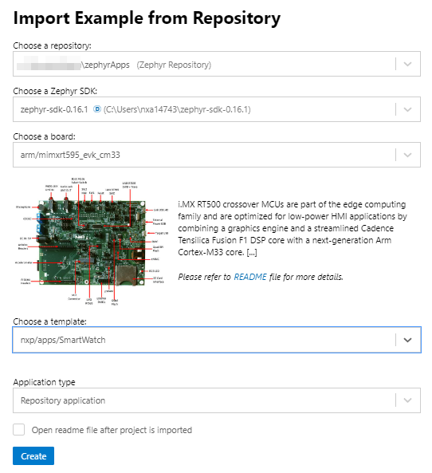

# SmartWatch Zephyr Demo - see [webinar](https://www.nxp.com/design/training/designing-for-low-power-using-zephyr-project-a-smartwatch-example:TIP-DESIGN-LOW-POWER-ZEPHYR-SMARTWATCH)
Wearable example application optimized for the i.MX RT500 MCU:
* Leverages display driver to MIPI smart wearable display
* Power-optimized reference for battery-powered devices
* Leverages Zephyr’s Power Management subsystem
* Demonstrates power-optimization techniques for applications
* UI created with LVGL and NXP’s [GUI-Guider tool](https://www.nxp.com/design/software/development-software/gui-guider:GUI-GUIDER)
* Professional LVGL graphics with multiple animated watch screens
* Leverages GPU acceleration to offload CPU

# Hardware Requirements
* [MIMXRT595-EVK](https://www.nxp.com/design/development-boards/i-mx-evaluation-and-development-boards/i-mx-rt595-evaluation-kit:MIMXRT595-EVK)
* [G1120B0MIPI](https://www.nxp.com/design/development-boards/i-mx-evaluation-and-development-boards/1-2-wearable-display-g1120b0mipi:G1120B0MIPI) 1.2in 390x390 MIPI display module
* micro USB cable

# Setup build environment
zephyrApps is a West manifest repository.  It uses West to pull in the Zephyr
repo and modules, including hal_nxp, see [West T2 star topology](https://docs.zephyrproject.org/latest/guides/west/workspaces.html#t2-star-topology-application-is-the-manifest-repository).  

## Installing Zephyr tools and dependencies 
Install all the needed tools and dependencies for using Zephyr.  NXP recommends
using the MCUXpresso Installer to install all the tools and dependencies.  This
tool is installed if using the VS Code MCUXpresso extension, see the
[wiki](https://github.com/nxp-mcuxpresso/vscode-for-mcux/wiki/Dependency-Installation).

## Cloning the application repo 
The typical Zephyr development flow
is used by this repo.  This uses the West tool, and requires these tools and
Zephyr dependencies to be install on the host computer.  The two options
supported are:
- Using Visual Studio Code (VS Code) with NXP's MCUXpresso extension
- Using West with the Command Line Interface (CLI)

### Cloning and building with VS Code
- Follow the steps at [MCUXpresso for Visual Studio Code](https://github.com/nxp-mcuxpresso/vscode-for-mcux/wiki).  This includes using NXP's MCUXpresso Installer to install all the needed tools and dependencies for using Zephyr with VS Code.  Review these steps for how to import a Zephyr repo, and how to import a Zephyr sample application from that repo.
- In VS Code, using the MCUXpresso extension, open the **Import Repository** wizard.  This example creates a folder called `zephyrApps` for the workspace.  Import the repo `https://github.com/nxp-zephyr/apps_zephyr`, and set the Revision to `SmartWatch`.

  

Then you can **Import Example from Repository**.  The example below imports the `SmartWatch` app for the `mimxrt595_evk_cm33` board:

  

Then follow the steps detailed at [MCUXpresso for Visual Studio Code](https://github.com/nxp-mcuxpresso/vscode-for-mcux/wiki) to build and debug the sample application.  Detailed [Zephyr lab guides](https://github.com/nxp-mcuxpresso/vscode-for-mcux/wiki/Training-Zephyr-Getting-Started-RT1060) are also provided at that wiki.

### Cloning and building with CLI 
Start in the directory you want the zephyrApps folder located:
```
west init zephyrApps -m https://github.com/nxp-zephyr/apps_zephyr --mr SmartWatch
cd zephyrApps
west update
setup environment variables:
        (for Windows) zephyr\zephyr-env.cmd
        (for Ubuntu) source zephyr/zephyr-env.sh
cd nxp
west build -b mimxrt595_evk_cm33 apps\SmartWatch --pristine
```
# Power Optimizations
This demo leverages several optimizations to reduce power consumption and extend battery life.  These optimizations are configurable.  Most are configured using Kconfig symbols in `prj.conf`.  Some optimizations are enabled using CMake variables during the build.  These include:
* `SMARTWATCH_IN_RAM_APP`
* `SMARTWATCH_REDUCE_RAM`

## Setting CMake variables in MCUXpresso extension for VS Code
* Open the project file `zephyrapps/nxp/apps/SmartWatch/.vscode/cmake-kits.json`
* Add the CMake variables to the `cmakeSettings` section as shown below:
```
[
  {
    "name": "Zephyr build tool",
    "environmentVariables": {
      "ZEPHYR_BASE": "${command:mcuxpresso.repoPath}/zephyr",
      "ZEPHYR_SDK_INSTALL_DIR": "${command:mcuxpresso.toolchainPath}/../"
    },
    "cmakeSettings": {
      "BOARD": "mimxrt595_evk_cm33",
      "SMARTWATCH_IN_RAM_APP": "y",
      "SMARTWATCH_REDUCE_RAM": "y",
      "APP_DIR": "${workspaceFolder}"
    },
    "keep": true
  }
]
```

## Setting CMake variables with CLI
The variables can also be defined with the `west build` command, like this:
```
west build -b mimxrt595_evk_cm33 apps\SmartWatch --pristine -DSMARTWATCH_IN_RAM_APP -DSMARTWATCH_REDUCE_RAM
```

# SmartWatch folder structure:
```
zephyrApps/
│
├── modules/                            # other modules pulled in by West
│   ├── hal/
│   │   ├── appswpacks-dvs-pvt-sensor   # PVT Sensor library
│   │   ├── cmsis/
│   │   └── nxp                         # NXP's HAL with MCUXpresso SDK drivers
│   └── lib/
│       └── gui
│           └── lvgl
├── nxp/                                # West manifest repo for application
│   ├── apps/
│   │   └── SmartWatch/                 # demo application
└── zephyr/                             # module pulled in by West from zephyr-proper or NXP fork
```

# Debug pins
* CLKOUT - J18-p1, P2_29, measures clock frequency
* DBG_P1 - J28-p1, P4_28, set high when exiting PM state, low when entering PM state
